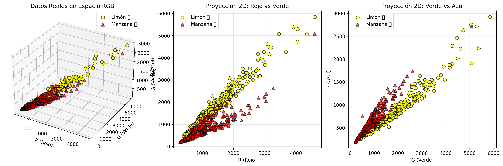

# 🧠 Clasificador de Frutas con Red Neuronal (TCS34725 + Python + ML)

Sistema completo de clasificación de frutas utilizando un sensor de color TCS34725 conectado a un microcontrolador (Arduino / ESP32) y una red neuronal entrenada con scikit-learn.



## ✨ Características

- 📊 **Recolección de datos**: Captura muestras RGB del sensor y las guarda en CSV.
- 🧠 **Red neuronal**: Clasificador MLP entrenado para distinguir entre frutas.
- 🔴 **Clasificación en vivo**: Predicción en tiempo real con nivel de confianza.
- 📈 **Visualización 3D**: Gráficas del espacio de color RGB con las muestras.

## Requisitos

### Hardware
- Sensor TCS34725 conectado a una placa (Arduino o ESP32).
- Cable USB conectado al equipo.

### Software
- Python 3.9+
- Git (opcional)

## Instalación

1. Clonar el repositorio:
```bash
git clone https://github.com/itsebasvz/redneuronalrgb.git
cd redneuronalrgb
```

2. Crear y activar un entorno virtual:

En Linux / macOS:
```bash
python -m venv venv
source venv/bin/activate
```

En Windows (CMD / PowerShell):
```bash
python -m venv venv
venv\Scripts\activate
```

3. Instalar dependencias base:
```bash
pip install -r requirements.txt
```

4. Instalar dependencias de Machine Learning (para entrenamiento y clasificación):
```bash
pip install -r requirements_ml.txt
```

## Uso

El flujo de trabajo del proyecto se divide en tres etapas:

### 1️⃣ Recolección de Datos

Conectar la placa y ejecutar:
```bash
python recolectar_colores.py
```

Salida esperada:
```
✅ Conectado a /dev/ttyUSB0
Presiona:
  [l] → limon
  [m] → manzana
  [z] → zanahoria
  [f] → fondo
Ctrl+C para terminar.
```

Al presionar una tecla se registra la muestra del sensor; al terminar con Ctrl+C se guarda automáticamente en el archivo CSV.

### 2️⃣ Entrenamiento del Modelo

Una vez recolectados suficientes datos, entrenar la red neuronal:
```bash
python entrenar_red_neuronal.py
```

Este script:
- Carga los datos del CSV
- Normaliza las características RGB
- Divide los datos en entrenamiento (80%) y prueba (20%)
- Entrena una red neuronal MLP con 10 neuronas en la capa oculta
- Muestra métricas de precisión y matriz de confusión
- Genera una visualización 3D guardada en `visualizacion_clasificacion.png`
- Guarda el modelo entrenado en `modelo_red_neuronal.pkl` y `scaler.pkl`

### 3️⃣ Clasificación en Vivo

Usar el modelo entrenado para clasificar frutas en tiempo real:
```bash
python clasificar_en_vivo.py
```

Salida esperada:
```
============================================================
CLASIFICADOR DE FRUTAS EN TIEMPO REAL
============================================================
✅ Conectado a /dev/ttyUSB0
 Esperando datos del sensor TCS34725...
Presiona ENTER para clasificar la fruta actual
Ctrl+C para terminar.

[12:30:15] RGB(1258, 1684, 746) → 🍋 LIMON
   limon     : 95.3% ███████████████████
   manzana   :  4.7% █
```

El sistema incluye un umbral de confianza del 70%; si la predicción no alcanza este nivel, mostrará "OBJETO NO RECONOCIDO".

## Formato del CSV

Cada fila del archivo de datos contiene:
```
timestamp | label | R | G | B
```
Ejemplo:
```
2025-11-11T20:31:55,limon,1258,1684,746
2025-11-11T20:32:04,manzana,1643,2156,932
```

## Arquitectura de la Red Neuronal

```
Entrada (3 neuronas)  →  Capa Oculta (10 neuronas, ReLU)  →  Salida (2 clases)
      [R, G, B]                                                [limón, manzana]
```

- **Normalización**: StandardScaler sobre valores RGB
- **Optimizador**: Adam
- **Máximo de iteraciones**: 1000

## Estructura del Proyecto

```
redneuronalrgb/
├── recolectar_colores.py       # Captura de muestras RGB
├── entrenar_red_neuronal.py    # Entrenamiento del modelo
├── clasificar_en_vivo.py       # Clasificación en tiempo real
├── modelo_red_neuronal.pkl     # Modelo entrenado (generado)
├── scaler.pkl                  # Escalador de datos (generado)
├── visualizacion_clasificacion.png  # Gráficas 3D (generado)
├── datos_colores.csv           # Datos recolectados (gitignored)
├── .env                        # Configuración del puerto serial
├── .gitignore
├── requirements.txt            # Dependencias base
├── requirements_ml.txt         # Dependencias de ML
├── LICENSE
└── README.md
```

## Configuración

Edita el archivo `.env` para ajustar la configuración:

```env
PUERTO=/dev/ttyUSB0
BAUDIOS=115200
ARCHIVO_CSV=datos_colores.csv
```

## Notas

- Ajusta `PUERTO` y `BAUDIOS` según tu placa (ej. `/dev/ttyACM0` en Linux, `COM3` en Windows).
- Puedes añadir más etiquetas/clases modificando el script de recolección y re-entrenando el modelo.
- El archivo `datos_colores.csv` está en `.gitignore` ya que contiene datos locales de cada usuario.

## Licencia

Este proyecto está bajo la licencia MIT. Ver [LICENSE](LICENSE) para más detalles.
